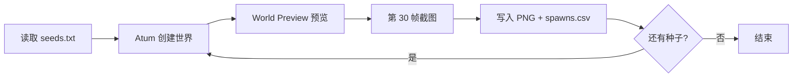

# Minecraft 速通 AI 数据集采集

在 **Minecraft 1.16.1（Fabric）** 中，按种子列表自动批量截图并记录出生点坐标，用于速通 AI 训练数据集。

本仓库用 **Fabric mod**（`datasetcollect`）替代原先的外部 Python 脚本 `capture.py`，与 **Atum**、**World Preview**、**SpeedrunAPI** 配合工作。

## 目录结构

```
code/
├── README.md                 # 本文件
├── .gitignore
├── datasetcollect/           # Fabric mod 源码与构建
│   ├── src/
│   ├── libs/                 # 编译用依赖 jar（Atum / World Preview / SpeedrunAPI）
│   ├── build.gradle
│   └── gradlew.bat
├── scripts/
│   ├── generate_seeds.py     # 生成 seeds.txt
│   └── capture.py            # 旧版外部采集脚本（已被 mod 取代，仅供参考）
└── examples/
    ├── seeds.txt.example
    └── datasetcollect.cfg.example
```

## 依赖 Mod（运行时）

| Mod | 版本（已测试） |
|-----|----------------|
| Fabric Loader | 0.16.x |
| Fabric API | 0.42.0+1.16 或实例内版本 |
| Atum | 2.7.2+1.16-1.16.1 |
| World Preview | 6.3.1+1.16.1 |
| SpeedrunAPI | 2.2+1.16-1.16.1 |
| **datasetcollect** | 本仓库构建产物 |

将 `datasetcollect-1.0.0.jar` 与上述 mod 一并放入实例的 `mods/` 文件夹。
可选择使用速通官方的优化模组（参考 `https://github.com/Minecraft-Java-Edition-Speedrunning/legal-mods`）加快采集速度

## 构建 mod

**要求：** JDK 8 或更高（推荐 JDK 17/21），Windows 下设置好 `JAVA_HOME`。

```bat
cd datasetcollect
gradlew.bat build
```

产物：`datasetcollect/build/libs/datasetcollect-1.0.0.jar`

`libs/` 内已包含编译所需的三个 Contaria mod jar。若你更换版本，请替换对应 jar 并重新构建。

## 游戏内配置

在 **游戏根目录**（`.minecraft/`，MultiMC 实例目录等）放置：

### `seeds.txt`

每行一个种子，支持负数。可参考 `examples/seeds.txt.example`。

```
123456789
-987654321
```

### `datasetcollect.cfg`（可选）

可参考 `examples/datasetcollect.cfg.example`：

| 键 | 默认值 | 说明 |
|----|--------|------|
| `auto_start` | `true` | 启动后是否自动开始采集 |
| `start_delay_seconds` | `8` | 自动开始前的等待秒数 |

## 使用方法

1. 安装依赖 mod 与本 mod，准备好 `seeds.txt`。
2. 启动游戏，进入主菜单。
3. **自动开始：** 默认约 8 秒后在主菜单自动开始（可在 `datasetcollect.cfg` 关闭）。
4. **手动开始：** 按 **F7**（可在控制设置中查看 `Dataset Collector` 键位）。
5. mod 通过 Atum 按种子列表依次创建世界；World Preview 预览约 0.5 秒后截图。
6. 输出目录：**`<游戏根目录>/dataset/`**

### 输出文件

| 文件 | 内容 |
|------|------|
| `{seed}.png` | 该种子的预览截图 |
| `spawns.csv` | `seed,x,z` 出生点坐标（追加写入） |

采集过程中会锁定：`viewDistance=5`、`fov=110`、HUD 显示。

## 工作流程（简述）

